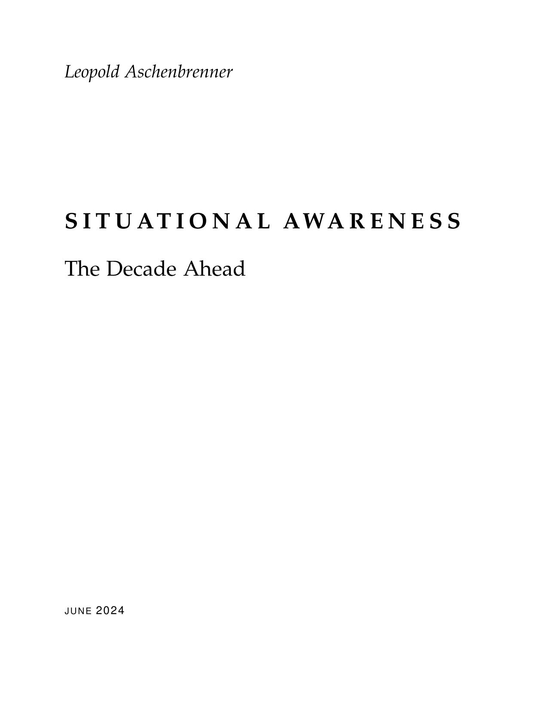
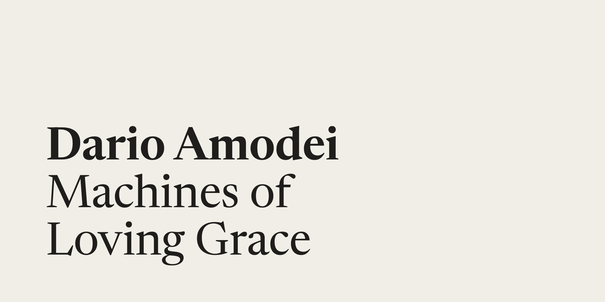
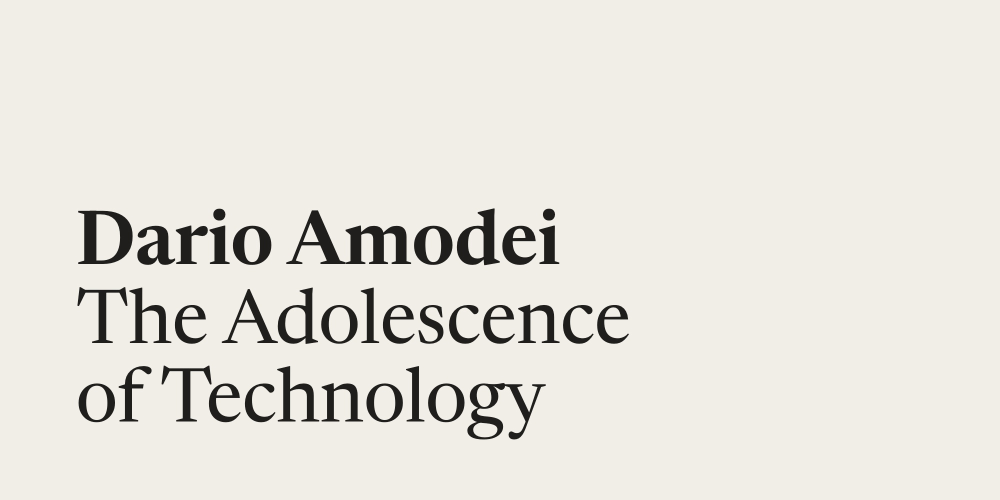
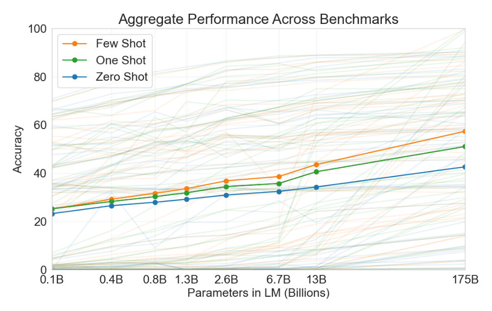

# Intelligence Explosion Reading List

Essays on the intelligence explosion — scaling, takeoff dynamics, alignment, and the geopolitics of getting through it. Converted from the authors' freely-published web originals to EPUB for offline / Kindle / e-reader use.

> **Read these at the source.** The canonical home for each essay is on its author's own site, linked below. The EPUBs here are mirrors for convenience — please go to the originals for the latest version, footnotes, and to support the authors directly.
>
> If you are an author of any work below and would prefer it removed, please open an issue and I'll take it down immediately.

---

<table>
<tr>
<td width="200" valign="top">
  <a href="./situational-awareness.epub"></a>
</td>
<td valign="top">

### Situational Awareness: The Decade Ahead

**Leopold Aschenbrenner** · June 2024 · ~165 pages

Nine-part series arguing that AGI by roughly 2027 is plausible from straight-line extrapolation of compute, algorithmic efficiency, and "unhobbling" gains — followed by an intelligence explosion, a national-security race, and the geopolitical implications that follow.

📖 [`situational-awareness.epub`](./situational-awareness.epub) · 27 MB · with all 43 figures, internal cross-chapter links<br>
🌐 Read online: [situational-awareness.ai](https://situational-awareness.ai/) · [Official PDF](https://situational-awareness.ai/wp-content/uploads/2024/06/situationalawareness.pdf)

</td>
</tr>
</table>

---

<table>
<tr>
<td width="200" valign="top">
  <a href="./machines-of-loving-grace.epub"></a>
</td>
<td valign="top">

### Machines of Loving Grace

**Dario Amodei** · October 2024 · ~50 pages

The optimistic case. What a post-AGI world looks like if it goes well — biology, neuroscience, economic development, governance, work and meaning. Counterweight to the doom literature.

📖 [`machines-of-loving-grace.epub`](./machines-of-loving-grace.epub) · 72 KB<br>
🌐 Read online: [darioamodei.com/essay/machines-of-loving-grace](https://www.darioamodei.com/essay/machines-of-loving-grace)

</td>
</tr>
</table>

---

<table>
<tr>
<td width="200" valign="top">
  <a href="./the-adolescence-of-technology.epub"></a>
</td>
<td valign="top">

### The Adolescence of Technology

**Dario Amodei** · January 2026 · ~70 pages

The companion piece to *Machines of Loving Grace*. The risks side: national security, economic disruption, threats to democracy, and how civilizations defend against the failure modes of powerful AI.

📖 [`the-adolescence-of-technology.epub`](./the-adolescence-of-technology.epub) · 85 KB<br>
🌐 Read online: [darioamodei.com/essay/the-adolescence-of-technology](https://www.darioamodei.com/essay/the-adolescence-of-technology)

</td>
</tr>
</table>

---

<table>
<tr>
<td width="200" valign="top">
  <a href="./the-scaling-hypothesis.epub"></a>
</td>
<td valign="top">

### The Scaling Hypothesis

**Gwern Branwen** · 2020 (revised through 2022) · ~120 pages

Pre-GPT-4 essay arguing that scale alone might be sufficient for general intelligence — Sutton's bitter lesson taken to its conclusion, with extensive historical context and a tour through what we already knew when we should have known better.

📖 [`the-scaling-hypothesis.epub`](./the-scaling-hypothesis.epub) · 153 KB<br>
🌐 Read online: [gwern.net/scaling-hypothesis](https://gwern.net/scaling-hypothesis)

</td>
</tr>
</table>

---

## How these were built

All EPUBs are produced from the authors' published HTML/PDF, converted with [Calibre](https://calibre-ebook.com/)'s `ebook-convert`. The Aschenbrenner one scrapes all nine chapter pages from the official site, downloads the 43 figures locally so they're embedded, rewrites cross-chapter links to internal anchors, and merges into a single document before conversion.

```bash
pip install beautifulsoup4
brew install --cask calibre        # macOS, or install Calibre from elsewhere
python3 scripts/build_situational_awareness.py
```

The other three essays are single-page conversions:

```bash
ebook-convert essay.html essay.epub --epub-version 3 --title "..." --authors "..."
```

## Sending to Kindle

Drop any of the `.epub` files on [Send to Kindle](https://www.amazon.com/sendtokindle), or email as an attachment to your `*@kindle.com` address. EPUB 3 is preferred — Send to Kindle's web uploader has been finicky about EPUB 2 in past attempts.

## Attribution & licensing

All essays are © their respective authors (Leopold Aschenbrenner, Dario Amodei, Gwern Branwen). Cover images are from each author's own website. The EPUBs are mirrored here for offline reading convenience with prominent attribution and links to the canonical sources. The authors retain all rights; please respect their preferences if they ask for content to be removed.

The build scripts in this repository are MIT-licensed (see [`LICENSE`](./LICENSE)).
